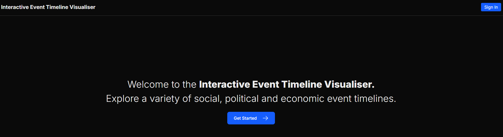

# Event Timeline Visualiser
#### Table of Contents
- [About](#about)
- [Usage](#usage)
- [Features](#features)
- [Technology Stack](#technology-stack)
- [Local Installation Guide](#local-installation-guide)
- [Directory Structure](#directory-structure)
- [API Endpoints](#api-endpoints)
- [Continuous Integration](#continuous-integration)

## About

The **Event Timeline Visualiser** is an interactive web-application that allows users to explore a variety of political/economic/social timelines via an intuitive user interface.
Timelines consists of a variety of events, which include: political statements, news events, ecnomic policy changes, and much more! This project aims to promote a bias-free reporting of factual events, allowing users to explore events in the world of current affairs in an accessible manner. To explore the capabilities of the Event Timeline Visualiser, see the [features](#features) section.

## Usage
The Event Timeline Visualiser application publicly accessible at [event-timeline-visualiser.vercel.app/](https://event-timeline-visualiser.vercel.app/). If you wish to run a local version of the application, please see the dedicated [guide](#local-installation-guide).

## Features
Features + screenshots. Important to explain all different forms of timelines.

## Technology Stack
- **MongoDB** serves as the application's database, with backend interaction utilising the [Mongoose]("https://mongoosejs.com/") object modelling tool.
- **NextJS** utilised as a full-stack framework, with [React]("https://react.dev/") as the web-library.
- **TypeScript** programming language used throughout the application.


## Local Installation Guide
```bash
# Open a terminal and clone the repository
git clone https://github.com/craig-sinclair/event-timeline-visualiser.git
```

> [!IMPORTANT]
> Environmetal variables are required for setup to allow for MongoDB interaction. For reference, a `.env.example` file has been created at the project root. Developers should create a `.env` file following this example, and update the `MONGODB_URI` to their own connection string.

`npm` was utilised as a package manager tool in this project. To install dependencies, from the project root folder `event-timeline-visualiser`:
```bash
# From the project root folder (event-timeline-visualiser)

# Install project dependencies with npm
npm install

# Use the provided datbase population script for sample data
npm run populate-data

# Run the development serve
npm run dev
```
The site shall then be accessible at [http://localhost:3000](http://localhost:3000).

## Directory structure
Following NextJS convention, routing to frontend pages and API endpoints is based upon the folder structure in the `src/app/` directory.

```
src/
  app/                        # Next.js routes (App Router)
    layout.tsx
    page.tsx
    dashboard/                # Displays all available timelines in a table format
      page.tsx
    events-in-topic/          # View all events with a particular ontology topic (across all timelines)
      [topicID]/
        page.tsx
    signin/                   # Sign-in form page
      page.tsx
    signup/                   # Profile registration page
      page.tsx
    profile/                  # View profile (signed in users only)
      page.tsx
    timeline/                 # View a specific timeline, defaulting to an appropriate view/style for event display
      [timelineID]/
        page.tsx

    api/                      # ONLY route handlers here (Next.js conventions)
      /admin              
        / users               # Fetch all users from database
          / route.ts
      /auth                   # Various routes for login, registration, fetching auth session
        ...
      /fetch-events           # Fetch all events in a given timeline
        /[timelineID]
          /route.ts
      /fetch-tmieline         # Fetch a timeline object by its ID
        /[timelineID]
          /route.ts
      /fetch-timelines        # Fetch all timelines in the DB
        /route.ts
      
      /fetch-topic-hierarchy  # Builds array of parent/grandparent/... topics from a given media (ontology) topic
        /[topicID]
          / route.ts

  components/
    ui/                       # Reusable UI primitives

    layout/                     # Page or app-level layout components
      ErrorBoundary.tsx

    modals/                     # modals/ pop-ups
      EventModal.tsx            # Event card with further information on specific event
      ExportTimelineModal.tsx   # Modal to handle exporting of timeline in HTML or image format

    CompareTimelines.tsx          # Allow grouped display of all events in multiple timelines
    ContinuousScaleTimeline.tsx   # Gradient format scale encoding position in timeline display
    HorizontalTimeline.tsx        # Standard horizontal format timeline of events
    VerticalTimeline.tsx          # Standard vertical format timeline of events
    TimelinesTable.tsx            # Table to list all events

  lib/                        # Framework-agnostic helpers (formatters, API clients)
                              # general-purpose utilities (date formatting, helper functions, API client setup).

  models/                     # TypeScript types, interfaces, schemas
                              # clear place for TypeScript interfaces, Zod schemas, or Prisma models.

  services/                   # Business logic (API calls, auth logic, etc.)
                              # domain-specific logic (auth service, database queries, feature APIs).

  hooks/                      # Custom React hooks


  config/                     # App-wide constants, env configs
                              # avoids sprinkling env vars everywhere.

  utils/                      # Miscellaneous utilities
    event-styles.const.ts       # Stores base styling logic for event cards

  public/                     # Static assets

  __tests__/                  # Unit tests folder
```

## API Endpoints
Detail all available API endpoints, inputs expected, and what they return

## Overview of Files
Detail quick overview for important files; can be done in directory overview?

## Continuous Integration
The `.github/workflows/ci.yml` file specifies a CI pipeline to execute on each commit to the repository. This consists of a single job with four key phases:
1) Installation of project dependencies.
2) **Linting**: see more information on project styles and conventions this phase enforces [here](#code-styling-and-conventions).
3) **Unit test**: see more information on project unit testing [here](#unit-testing)
4) **Build**: which converts the project code into a production-ready build of the application.

#### Deployment on Vercel
The `main` branch on this repository automatically deploys to Vercel with new commits. Due to this, future contributions should ensure robust evaluation of code additions prior to committing changes to the main branch to avoid disruptions to the deployed environment. See more information on project conventions for branching and merge requests [here](#branching-strategy).
Production credentials are stored on GitHub under the repository secrets. Importantly, this includes the `MONGODB_URI` which links to the hosted MongoDB databse, via [Atlas Database](https://www.mongodb.com/products/platform/atlas-database).


#### Branching Strategy
This application makes use of the [feature branching](https://www.atlassian.com/git/tutorials/comparing-workflows/feature-branch-workflow) strategy. All new code contributions (bug fixes, new features, refactoring, etc) should be committed to a branch created from an issue on the GitHub repository. When changes are ready to enter the production environment, a merge request should be raised from the feature branch (branch created from an issue) into the `main` branch.
Before merging, the pipeline must have completed a successful run on the merge request before being changes are allowed to be merged onto the `main` branch. This serves as a protection method for the deployed environment 

#### Code Styling and Conventions
Add: information on code styling (what the lint stage enforces for code files).

#### Unit Testing
Add: package used for unit testing, patterns of unit testing, automated runs, local triggering of unit testing, importance of testing (particular lib functions + api routes).

#### Pre-Commit Hooks
After cloning the repository, and running `npm install`, this shall enable pre-commit hooks via the Husky package.
Currently, this executes the lint stage prior to all Git commits made, blocking if there are any lint errors.