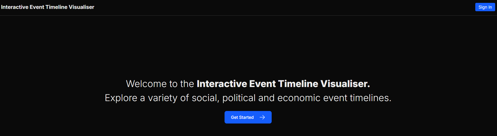
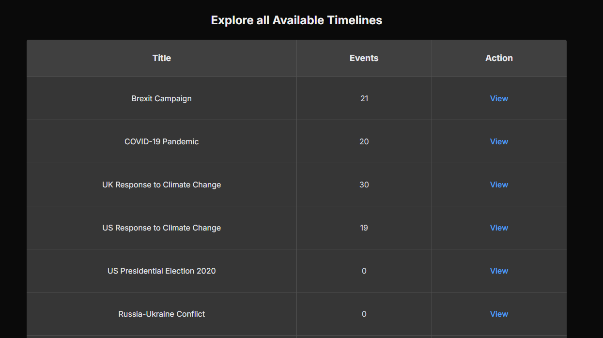
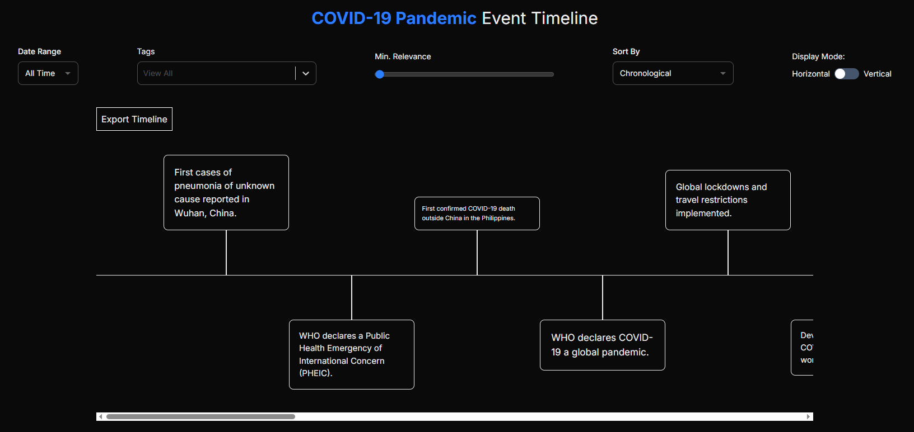
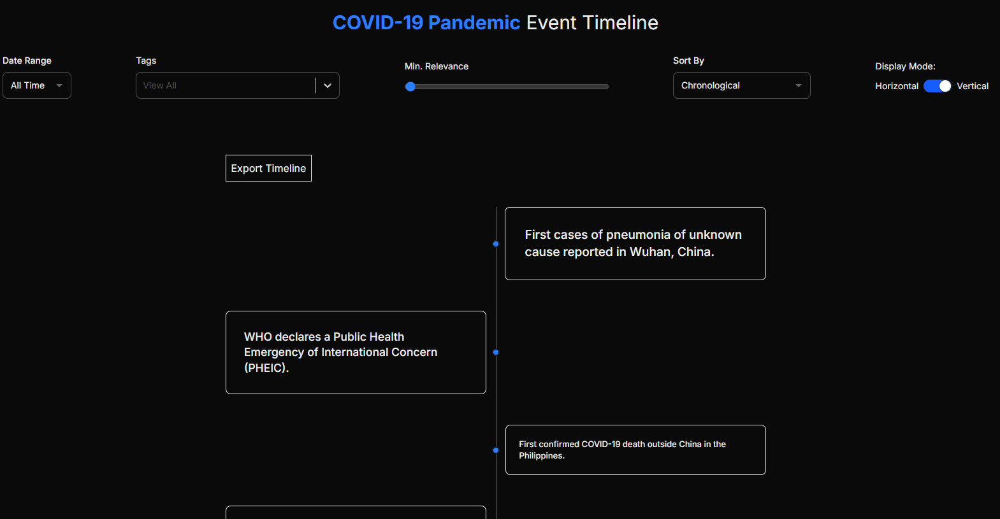
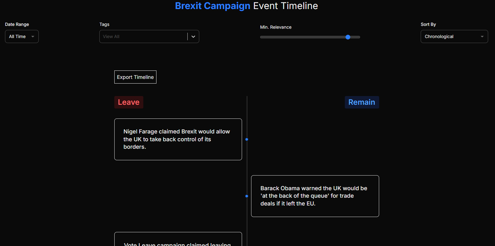
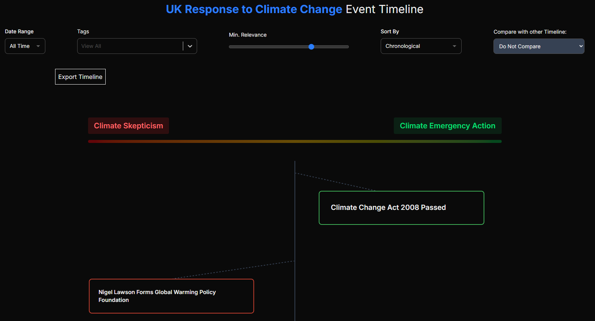

# TimelineScope
#### Table of Contents
- [About](#about)
- [Usage](#usage)
- [Features](#features)
- [Technology Stack](#technology-stack)
- [Local Installation Guide](#local-installation-guide)
- [Directory Structure](#directory-structure)
- [CI/CD](#cicd)

## About

**TimelineScope** is an interactive web-application that allows users to explore a variety of political/economic/social timelines via an intuitive user interface.
Timelines consists of a variety of events, which include: political statements, news events, ecnomic policy changes, and much more! This project aims to promote a bias-free reporting of factual events, allowing users to explore events in the world of current affairs in an accessible manner. To explore the capabilities of the TimelineScope, see the [features](#features) section.

## Usage
**TimelineScope** is publicly accessible at [event-timeline-visualiser.vercel.app/](https://event-timeline-visualiser.vercel.app/). If you wish to run a local version of the application, please see the dedicated [guide](#local-installation-guide).

## Features
Beyond the landing page, users are redirected to the home dashboard, which contains a table of all explorable timelines in the application:


There are a variety of available formats for viewing timelines, and the application aims to automatically determine the most appropriate view depending on the context of a particular timeline. These include:
1) Standard horizontal format timelines:


2) Standard vertical format timelines:


3) Two-sided timeline:


4) Continuous/gradient scale timelines (communicating each event's position within the timeline):


Note that in all cases, the timeline pages are equipped with a suite of helpful **filters** based on the content of events. This allows users to customise their view and explore topics most interesting to them.
Users may click on individual events, which displays a helpful pop-up with more information, sources, and topics related to that particular event.


## Technology Stack
- **MongoDB** serves as the application's database, with backend interaction utilising the [Mongoose]("https://mongoosejs.com/") object modelling tool.
- **NextJS** utilised as a full-stack framework, with [React]("https://react.dev/") as the web-library.
- **TypeScript** programming language used throughout the application.


## Local Installation Guide
#### Pre-Requisites
- **Node.js** installed: download from [nodejs.org](https://nodejs.org/en).
- A **MongoDB** instance accessible via a connection URI (e.g. `mongodb://localhost:27017/yourdb`). If required, see the [MongoDB installation guide](https://www.mongodb.com/docs/manual/installation/).
- **Git** installed on your local machine: download from [git](https://git-scm.com/).

```bash
# Open a terminal and clone the repository
git clone https://github.com/craig-sinclair/event-timeline-visualiser.git
```

> [!IMPORTANT]
> Environmetal variables are required for setup to allow for MongoDB interaction. For reference, a `.env.example` file has been created at the project root. Developers should create a `.env` file following this example, and update the `MONGODB_URI` to their own connection string.

`pnpm` was utilised as a package manager tool in this project. To install dependencies, from the project root folder `event-timeline-visualiser`:
```bash
# From the project root folder (event-timeline-visualiser)

# Install pnpm packager manage with npm (if required)
npm install pnpm

# Install project dependencies with npm
pnpm install

# Use the provided database population script for sample data
pnpm run populate-data

# Run the development serve
pnpm run dev
```
The site shall then be accessible at [http://localhost:3000](http://localhost:3000).

## Directory structure
Following NextJS convention, routing to frontend pages and API endpoints is based upon the folder structure in the `src/app/` directory.

```
src/
  app/
    layout.tsx
    page.tsx
    dashboard/
      page.tsx
    events-in-topic/
      [topicID]/
        page.tsx
    signin/
      page.tsx
    signup/
      page.tsx
    timeline/
      [timelineID]/
        page.tsx
    developers/
      page.tsx

    api/
      /admin              
      /auth
        /[...nextauth]
          /route.ts
      /signup
        /route.ts
      /fetch-events
        /[timelineID]
          /route.ts
      /fetch-tmieline
        /[timelineID]
          /route.ts
      /fetch-timelines
        /route.ts  
      /fetch-topic-hierarchy
        /[topicID]
          /route.ts
      /fetch-events-in-topic
        /[topicID]
          /route.ts
      /fetch-all-topics-in-timeline
        /[timelineID]
          /route.ts

  components/
    ui/
      DateRangeFilter.ts
      fonts.ts
      GradientScaleHeader.tsx
      LoadingSpinner.tsx
      Navbar.tsx
      ThemeToggle.tsx
      TimelineFilters.tsx
      TopicHierarchyText.tsx

    layout/
      ErrorBoundary.tsx

    modals/
      EventModal.tsx
      ExportTimelineModal.tsx

    About.tsx
    ContinuousScaleTimeline.tsx
    HorizontalTimeline.tsx
    VerticalTimeline.tsx
    TimelinesTable.tsx

  lib/
    auth.ts
    buildYearMonthTree.ts
    circuitBreaker.ts
    createEventCardStyle.ts
    exportTimelineHTML.ts
    exportTimelineImage.ts
    filterEvents.ts
    getAllChildTopics.ts
    getEventColour.ts
    mongodb.ts
    mongoose.ts
    sortEvents.ts
    validateSignUpFields.ts
    api/
      getAllTimelines.ts
      getAllTopicsInTimeline.ts
      getEventsInTimeline.ts
      getEventsInTopic.ts
      getEventTagsToTimelineMap.ts
      getTimelineFromId.ts
      getTopicHierarchy.ts

  models/
    api.ts
    circuitBreaker.types.ts
    dateFilters.types.ts
    entry.ts
    event.ts
    item.tsx
    ontology.ts
    ontology.types.ts
    timeline.ts
    user.ts
    userSchema.ts

  services/
    authService.ts
    passwordService.ts

  hooks/
    useEventModal.ts
    useIsMobile.ts

  utils/
    auth.const.ts
    event-styles.const.ts
    month-names.const.ts

  public/

  data/                       # JSON format data for population script and screenshots
    /screenshots

__tests__/

content/                      # Contains markdown content for developer documentation
```

## CI/CD

### Continuous Integration
The `.github/workflows/ci.yml` file specifies a CI pipeline to execute on each commit to the repository. This consists of a single job with four key phases:
1) Installation of project dependencies.
2) **Linting**: see more information on project styles and conventions this phase enforces [here](#code-styling-and-conventions).
3) **Unit test**: see more information on project unit testing [here](#unit-testing)
4) **Build**: which converts the project code into a production-ready build of the application.

### Continuous Deployment
The `main` branch on this repository automatically deploys to Vercel with new commits. Due to this, future contributions should ensure robust evaluation of code additions prior to committing changes to the main branch to avoid disruptions to the deployed environment. See more information on project conventions for branching and merge requests [here](#branching-strategy).
Production credentials are stored on GitHub under the repository secrets. Importantly, this includes the `MONGODB_URI` which links to the hosted MongoDB databse, via [Atlas Database](https://www.mongodb.com/products/platform/atlas-database).


### Branching Strategy
This application makes use of the [feature branching](https://www.atlassian.com/git/tutorials/comparing-workflows/feature-branch-workflow) strategy. All new code contributions (bug fixes, new features, refactoring, etc) should be committed to a branch created from an issue on the GitHub repository. When changes are ready to enter the production environment, a merge request should be raised from the feature branch (branch created from an issue) into the `main` branch.
Before merging, the pipeline must have completed a successful run on the merge request before being changes are allowed to be merged onto the `main` branch. This serves as a protection method for the deployed environment 

### Code Styling and Conventions
- Code styles and conventions are enforced throughout the project, and are specified in `eslint.config.mjs`.
- This enforces: double quotes for strings, trailing commas in objects, four tab style indentation/spacing, wrapping lines over one hundred characters, ... etc.
- Running `pnpm run lint` locally in a terminal shall execute the linter tool. Enable automating fixing of lint issues (where possible), with `pnpm run lint:fix`.

### Unit Testing
- The [Vitest](https://vitest.dev/) testing framework was used for all unit tests.
- The `__tests__/` directory aims to mirror the `src/` directory, with an emphasis on testing for API routes and `lib/` functions.
- Running `pnpm run test` locally in a terminal shall execute all unit tests in the `__test__/` directory.
- Frequently, interactions with the database are mocked. This is to ensure an isolated testing environment and to avoid unwanted changes to records.

Add: package used for unit testing, patterns of unit testing, automated runs, local triggering of unit testing, importance of testing (particular lib functions + api routes).

### Pre-Commit Hooks
After cloning the repository, and running `pnpm install`, this shall enable pre-commit hooks via the Husky package.
Currently, this executes the lint stage prior to all Git commits made, blocking if there are any lint errors.